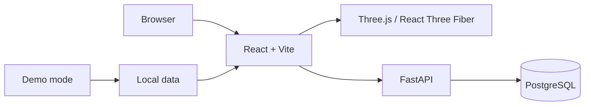

<p align="left">
  <strong>English</strong> |
  <a href="./README.ru.md">Русский</a>
</p>
# Astro Base

Astro Base is an application with an interactive 3D scene of the Solar System and an astrophotography feed.

Demo site - https://feg55.github.io/Astro-Base/


## About the project

Astro Base combines an interactive 3D scene of the Solar System with an astrophotography catalog. Selecting a celestial object in the scene is connected to the photo feed: users can search for images, apply object filters, and open detailed information about each photo.

The project supports two operating modes:

- **Demo mode** — a fully static version with local data, suitable for GitHub Pages;
- **Full-stack mode** — the frontend connects to FastAPI and PostgreSQL, enabling user accounts, photo uploads, and the admin panel.

## Features

### Main application

- interactive 3D scene of the Solar System;
- selection of celestial objects directly in the scene;
- astrophotography feed;
- text search across photos;
- filtering by individual objects and groups of objects;
- reset of active filters;
- photo and description viewing in a modal window;
- automatic fallback to local demo data when the API is unavailable.

### Accounts and photo publishing

These features are available only when the backend is connected:

- registration and sign-in;
- JWT authentication;
- image uploads up to 8 MB;
- fields for title, celestial object, telescope, camera, coordinates, shooting location, and description;
- display of a newly uploaded photo in the feed.

### Admin panel

Administrators can:

- view statistics for users, administrators, photos, and image storage size;
- search for users by name, username, or email;
- filter users by role;
- create users;
- change the `member` and `admin` roles;
- delete a user while either keeping or deleting their photos;
- delete all photos from the database after confirming the action.

## Operating modes

| Feature | Demo mode | Full-stack mode |
| --- | :---: | :---: |
| 3D scene | ✅ | ✅ |
| Astrophotography feed | ✅ | ✅ |
| Search and filters | ✅ | ✅ |
| Local demo data | ✅ | ✅ when the API fails |
| PostgreSQL data | ❌ | ✅ |
| Registration and sign-in | ❌ | ✅ |
| Photo uploads | ❌ | ✅ |
| Admin panel | ❌ | ✅ |


## Technologies

| Project area | Technologies |
| --- | --- |
| Frontend | React 19, TypeScript, Vite |
| 3D scene | Three.js, React Three Fiber, React Spring |
| State management | Zustand |
| Backend | Python 3.11+, FastAPI, SQLAlchemy, Alembic |
| Database | PostgreSQL 16, asyncpg |
| Authentication | JWT, passlib, bcrypt |
| Local infrastructure | Docker Compose |
| Frontend deployment | GitHub Actions, GitHub Pages |

## Architecture



In demo mode, the frontend does not communicate with the server. In full-stack mode, FastAPI provides routes for authentication, celestial objects, photos, and administrative features.

## Project structure

```text
frontend/                 React, TypeScript, Vite, and static textures
backend/                  FastAPI, SQLAlchemy, Alembic, and seed data
docker-compose.yml        PostgreSQL for local development
.github/workflows/        frontend deployment to GitHub Pages
```

## Requirements

To run the frontend:

- Node.js;
- npm.

Additional requirements for full-stack mode:

- Python 3.11 or newer;
- Docker and Docker Compose.

## Quick start

### Frontend in demo mode

The backend and PostgreSQL are not required in this mode.

#### PowerShell

```powershell
cd frontend
npm ci
$env:VITE_DEMO_MODE="true"
npm run dev
```

#### Bash, macOS, or Linux

```bash
cd frontend
npm ci
VITE_DEMO_MODE=true npm run dev
```

The application will be available at `http://localhost:5173`.

## Full local setup

### 1. Start PostgreSQL

From the project root:

```bash
docker compose up -d postgres
```

The container uses PostgreSQL 16 and exposes the database on `localhost:5433`.

### 2. Configure and start the backend

#### PowerShell

```powershell
cd backend
python -m venv .venv
.\.venv\Scripts\Activate.ps1
python -m pip install -e ".[dev]"
Copy-Item .env.example .env
alembic upgrade head
python -m app.seed
python -m uvicorn app.main:app --reload --host 127.0.0.1 --port 8000
```

<<<<<<< HEAD
#### Bash, macOS, or Linux
=======
PostgreSQL доступен на `localhost:5433`, API - на `http://127.0.0.1:8000`.
>>>>>>> c78737fadfadc0b0caa80f7667aa1b8707f10930

```bash
cd backend
python3 -m venv .venv
source .venv/bin/activate
python -m pip install -e ".[dev]"
cp .env.example .env
alembic upgrade head
python -m app.seed
python -m uvicorn app.main:app --reload --host 127.0.0.1 --port 8000
```

The API will be available at `http://127.0.0.1:8000`.

API health check:

```text
http://127.0.0.1:8000/health
```

### 3. Start the frontend

In a separate terminal:

```bash
cd frontend
npm ci
npm run dev
```

By default, the frontend connects to the API at `http://127.0.0.1:8000`.

### Local addresses

| Service | Address |
| --- | --- |
| Frontend | `http://localhost:5173` |
| Backend API | `http://127.0.0.1:8000` |
| Health check | `http://127.0.0.1:8000/health` |
| Admin panel | `http://localhost:5173/admin` |
| PostgreSQL | `localhost:5433` |

## Environment variables

### Frontend

| Variable | Purpose |
| --- | --- |
| `VITE_DEMO_MODE` | When set to `true`, enables local demo data and disables features that require the backend |
| `VITE_API_URL` | Public or local FastAPI address; defaults to `http://127.0.0.1:8000` |

Example using a different API address:

```powershell
$env:VITE_API_URL="https://api.example.com"
npm run dev
```

```bash
VITE_API_URL="https://api.example.com" npm run dev
```

### Backend

After copying `backend/.env.example`, the following settings are available:

| Variable | Purpose |
| --- | --- |
| `DATABASE_URL` | PostgreSQL connection string |
| `JWT_SECRET_KEY` | Secret key used to sign JWTs |
| `ACCESS_TOKEN_EXPIRE_MINUTES` | Token lifetime in minutes |
| `CORS_ORIGINS` | Comma-separated list of allowed frontend origins |

> [!WARNING]
> Always replace the `JWT_SECRET_KEY` value before deploying publicly.

## Test accounts

Running `python -m app.seed` creates local test accounts:

| Role | Email | Password |
| --- | --- | --- |
| Admin | `admin@astrobase.local` | `astro-admin-password` |
| User | `demo@astrobase.local` | `astro-demo-password` |

> [!WARNING]
> These credentials are intended only for local development. Do not use the test passwords in a public environment.

<<<<<<< HEAD
## Frontend checks
=======


Workflow [.github/workflows/deploy-pages.yml](.github/workflows/deploy-pages.yml) уже собирает содержимое `frontend/` и публикует его при push в `main`.
>>>>>>> c78737fadfadc0b0caa80f7667aa1b8707f10930

```bash
cd frontend
npm run lint
npm run build
npm run preview
```

- `npm run lint` runs ESLint;
- `npm run build` performs TypeScript checks and creates a production build;
- `npm run preview` serves the built application locally.

## GitHub Pages demo

The [.github/workflows/deploy-pages.yml](.github/workflows/deploy-pages.yml) workflow builds the contents of `frontend/` and publishes them when changes to the frontend or the workflow itself are pushed to `main`. It can also be started manually through `workflow_dispatch`.

On a free GitHub account, the repository must be public to use GitHub Pages.

1. Open the repository → `Settings` → `Pages`.
2. Under `Build and deployment`, select `Source: GitHub Actions`.
3. Commit your changes and push them to GitHub.
4. Wait for the `Deploy frontend to GitHub Pages` workflow to finish on the `Actions` tab.

Demo address: `https://feg55.github.io/Astro-Base/`.

Without additional configuration, GitHub Pages runs the static demo mode. The 3D scene, feed, search, filters, and photo viewer are available. Registration, sign-in, photo uploads, and the admin panel are disabled.

## Connecting the backend to GitHub Pages

GitHub Pages publishes only the static frontend and does not run FastAPI or PostgreSQL. To use full-stack mode, the backend must be deployed separately over HTTPS.

After deploying the backend:

1. In GitHub, open `Settings` → `Secrets and variables` → `Actions` → `Variables`.
2. Create a repository variable named `VITE_API_URL` and set it to the public HTTPS address of the API.
3. Add `https://feg55.github.io` to the backend `CORS_ORIGINS`.
4. Restart the `Deploy frontend to GitHub Pages` workflow.

The workflow automatically enables demo mode when `VITE_API_URL` is not set.
