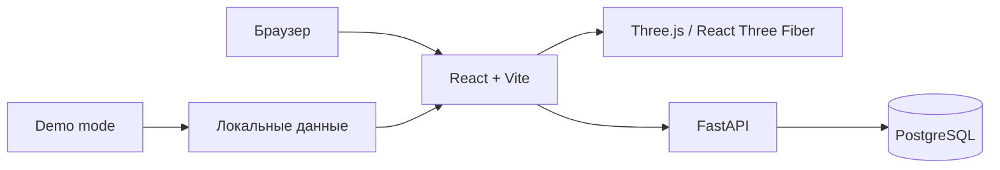

<p align="right">
  <a href="./README.md">English</a> |
  <a href="./README.ru.md">Русский</a>
</p>

# Astro Base

Astro Base - приложение с интерактивной 3D-сценой Солнечной системы и лентой астрофотографий.

Demo site - https://feg55.github.io/Astro-Base/


## О проекте

Astro Base объединяет интерактивную 3D-сцену Солнечной системы и каталог астрофотографий. Выбор небесного объекта на сцене связан с лентой снимков: пользователь может искать фотографии, применять фильтры по объектам и открывать подробную информацию о каждом снимке.

Проект поддерживает два режима работы:

- **Demo mode** — полностью статическая версия с локальными данными, подходящая для GitHub Pages;
- **Full-stack mode** — frontend подключается к FastAPI и PostgreSQL, благодаря чему становятся доступны аккаунты, загрузка фотографий и административная панель.

## Возможности

### Основное приложение

- интерактивная 3D-сцена Солнечной системы;
- выбор небесного объекта непосредственно на сцене;
- лента астрофотографий;
- текстовый поиск по снимкам;
- фильтрация по отдельным объектам и группам объектов;
- сброс активных фильтров;
- просмотр снимка и его описания в модальном окне;
- автоматический переход на локальные демо-данные, если API недоступен.

### Аккаунты и публикация снимков

Функции доступны только при подключённом backend:

- регистрация и вход;
- JWT-авторизация;
- загрузка изображения размером до 8 МБ;
- указание названия, небесного объекта, телескопа, камеры, координат, места съёмки и описания;
- отображение опубликованного снимка в ленте после загрузки.

### Административная панель

Администратору доступны:

- сводка по пользователям, администраторам, фотографиям и объёму изображений;
- поиск пользователей по имени, username или email;
- фильтрация пользователей по роли;
- создание пользователей;
- изменение ролей `member` и `admin`;
- удаление пользователя с сохранением или удалением его фотографий;
- полная очистка фотографий из базы с подтверждением действия.

## Режимы работы

| Возможность | Demo mode | Full-stack mode |
| --- | :---: | :---: |
| 3D-сцена | ✅ | ✅ |
| Лента астрофотографий | ✅ | ✅ |
| Поиск и фильтры | ✅ | ✅ |
| Локальные демо-данные | ✅ | ✅ при ошибке API |
| Данные из PostgreSQL | ❌ | ✅ |
| Регистрация и вход | ❌ | ✅ |
| Загрузка фотографий | ❌ | ✅ |
| Административная панель | ❌ | ✅ |


## Технологии

| Часть проекта | Технологии |
| --- | --- |
| Frontend | React 19, TypeScript, Vite |
| 3D-сцена | Three.js, React Three Fiber, React Spring |
| Состояние | Zustand |
| Backend | Python 3.11+, FastAPI, SQLAlchemy, Alembic |
| База данных | PostgreSQL 16, asyncpg |
| Авторизация | JWT, passlib, bcrypt |
| Локальная инфраструктура | Docker Compose |
| Деплой frontend | GitHub Actions, GitHub Pages |

## Архитектура



В demo mode frontend не обращается к серверу. В полноценном режиме FastAPI предоставляет маршруты авторизации, небесных объектов, снимков и административных функций.

## Структура проекта

```text
frontend/                 React, TypeScript, Vite и статические текстуры
backend/                  FastAPI, SQLAlchemy, Alembic и seed-данные
docker-compose.yml        PostgreSQL для локальной разработки
.github/workflows/        публикация frontend на GitHub Pages
```

## Требования

Для запуска frontend:

- Node.js;
- npm.

Дополнительно для full-stack режима:

- Python 3.11 или новее;
- Docker и Docker Compose.

## Быстрый запуск

### Frontend в demo mode

В этом режиме backend и PostgreSQL не нужны.

#### PowerShell

```powershell
cd frontend
npm ci
$env:VITE_DEMO_MODE="true"
npm run dev
```

#### Bash, macOS или Linux

```bash
cd frontend
npm ci
VITE_DEMO_MODE=true npm run dev
```

Приложение откроется на `http://localhost:5173`.

## Полный локальный запуск

### 1. Запустите PostgreSQL

Из корня проекта:

```bash
docker compose up -d postgres
```

Контейнер использует PostgreSQL 16 и публикует базу на `localhost:5433`.

### 2. Настройте и запустите backend

#### PowerShell

```powershell
cd backend
python -m venv .venv
.\.venv\Scripts\Activate.ps1
python -m pip install -e ".[dev]"
Copy-Item .env.example .env
alembic upgrade head
python -m app.seed
python -m uvicorn app.main:app --reload --host 127.0.0.1 --port 8000
```

#### Bash, macOS или Linux

```bash
cd backend
python3 -m venv .venv
source .venv/bin/activate
python -m pip install -e ".[dev]"
cp .env.example .env
alembic upgrade head
python -m app.seed
python -m uvicorn app.main:app --reload --host 127.0.0.1 --port 8000
```

API будет доступен на `http://127.0.0.1:8000`.

Проверка состояния API:

```text
http://127.0.0.1:8000/health
```

### 3. Запустите frontend

В отдельном терминале:

```bash
cd frontend
npm ci
npm run dev
```

По умолчанию frontend обращается к API на `http://127.0.0.1:8000`.

### Локальные адреса

| Сервис | Адрес |
| --- | --- |
| Frontend | `http://localhost:5173` |
| Backend API | `http://127.0.0.1:8000` |
| Health check | `http://127.0.0.1:8000/health` |
| Админ-панель | `http://localhost:5173/admin` |
| PostgreSQL | `localhost:5433` |

## Переменные окружения

### Frontend

| Переменная | Назначение |
| --- | --- |
| `VITE_DEMO_MODE` | При значении `true` включает локальные демо-данные и отключает функции, требующие backend |
| `VITE_API_URL` | Публичный или локальный адрес FastAPI; по умолчанию `http://127.0.0.1:8000` |

Пример другого адреса API:

```powershell
$env:VITE_API_URL="https://api.example.com"
npm run dev
```

```bash
VITE_API_URL="https://api.example.com" npm run dev
```

### Backend

После копирования `backend/.env.example` доступны следующие настройки:

| Переменная | Назначение |
| --- | --- |
| `DATABASE_URL` | Строка подключения к PostgreSQL |
| `JWT_SECRET_KEY` | Секретный ключ для подписи JWT |
| `ACCESS_TOKEN_EXPIRE_MINUTES` | Время жизни токена в минутах |
| `CORS_ORIGINS` | Разрешённые адреса frontend через запятую |

> [!WARNING]
> Перед публичным развёртыванием обязательно замените значение `JWT_SECRET_KEY`.

## Тестовые аккаунты

После выполнения `python -m app.seed` создаются локальные тестовые аккаунты:

| Роль | Email | Пароль |
| --- | --- | --- |
| Админ | `admin@astrobase.local` | `astro-admin-password` |
| Пользователь | `demo@astrobase.local` | `astro-demo-password` |

> [!WARNING]
> Эти данные предназначены только для локальной разработки. Не используйте тестовые пароли в публичном окружении.

## Проверки frontend

```bash
cd frontend
npm run lint
npm run build
npm run preview
```

- `npm run lint` запускает ESLint;
- `npm run build` выполняет проверку TypeScript и собирает production-версию;
- `npm run preview` локально запускает собранное приложение.

## Демо на GitHub Pages

Workflow [.github/workflows/deploy-pages.yml](.github/workflows/deploy-pages.yml) собирает содержимое `frontend/` и публикует его при push в `main`, если изменились файлы frontend или сам workflow. Запуск также можно выполнить вручную через `workflow_dispatch`.

На бесплатном аккаунте репозиторий должен быть публичным, чтобы использовать GitHub Pages.

1. Откройте репозиторий → `Settings` → `Pages`.
2. В `Build and deployment` выберите `Source: GitHub Actions`.
3. Закоммитьте изменения и отправьте их в GitHub.
4. Дождитесь завершения workflow `Deploy frontend to GitHub Pages` во вкладке `Actions`.

Адрес демо: `https://feg55.github.io/Astro-Base/`.

Без дополнительных настроек Pages запускается в статическом demo mode. В нём работают 3D-сцена, лента, поиск, фильтры и просмотр снимков. Регистрация, вход, загрузка фотографий и административная панель отключены.

## Подключение backend к GitHub Pages

GitHub Pages публикует только статический frontend и не запускает FastAPI или PostgreSQL. Для полноценного режима backend необходимо разместить отдельно по HTTPS.

После развёртывания backend:

1. В GitHub откройте `Settings` → `Secrets and variables` → `Actions` → `Variables`.
2. Создайте repository variable `VITE_API_URL` с публичным HTTPS-адресом API.
3. Добавьте `https://feg55.github.io` в `CORS_ORIGINS` backend.
4. Перезапустите workflow `Deploy frontend to GitHub Pages`.

Workflow автоматически включает demo mode, когда переменная `VITE_API_URL` не задана.
